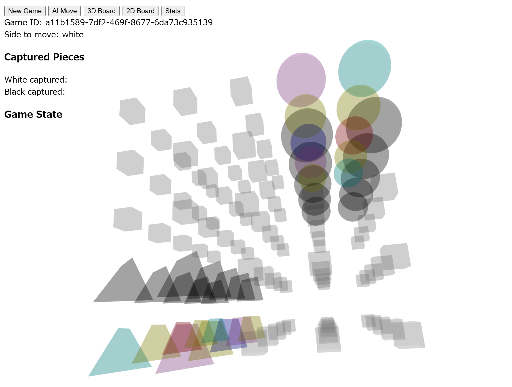

# RaumSchacha (3D-Chess) Board

## Overview
**RaumSchacha** is an experimental 3D chess variant, based on [RaumSchach rules](https://www.chessvariants.com/3d.dir/3d5.html). It expands classic chess into an extra dimension, creating a 5×5×5 board with new strategic possibilities. This repository provides a simple Python server and a front-end client for experimenting with these rules.



## Getting Started

### 1. Start the Python Server
1. Navigate to the server directory (if applicable).
2. Run the Python server:
   ```bash
   python server.py
    ```
3. Start the Front-End
Change directory to the 3D client:
    ```bash
    cd client/3d-raum
    python -m http.server
    ```
3. Open your browser and go to http://localhost:8000 to load the 3D chess interface.

### Rules Reference
For a detailed explanation of 3D chess concepts and the specific RaumSchach variant, see the Chess Variants article.
Key differences from standard chess:

A 5×5×5 cubic board, labeled in levels (A, B, C, D, E) and ranks (1–5).
Additional movement options on the vertical (Z) axis.
Potential new pieces or modifications to existing pieces for 3D movement.

### Contributing
Feel free to fork this repository and submit pull requests for any improvements or new features.
If you have suggestions or issues, open an issue in this repository.

### License
Currently, no explicit license is defined. Treat the code with the usual open-source courtesy—attribution and improvement are always appreciated.
